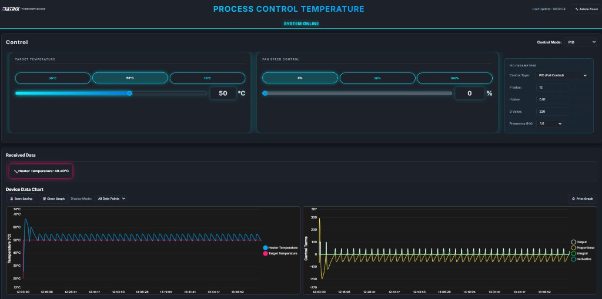

# Process Control Temperature App

Desktop + web app for controlling and monitoring a temperature process system using Serial/USB communication.

Current app version: `0.0.3`

---

## What This App Does

- Connects to hardware over Serial COM port or USB HID.
- Sends control commands (power, fan, target temperature, PID values).
- Receives live JSON data from hardware and updates the UI.
- Shows real-time charts for Manual, On/Off, and PID modes.
- Includes an Admin Panel for logs, PID tools, bootloader, and updates.
- Can run as Electron desktop app or as local web server for tablets.

## UI Preview

This is the current dashboard screen used in the app:



---

## Full Feature List

### 1) Control Modes

#### Manual Mode
- Power control: `0-100%`
- Fan speed control: `0-100%`
- Preset buttons for quick values
- Slider + input controls with live UI updates

#### On/Off Mode
- Target temperature: `20-70 C`
- Hysteresis options: `1, 2, 3, 4, 5, 10 C`
- Fan control
- Automatic heater on/off behavior around target and hysteresis

#### PID Mode
- Target temperature: `20-70 C`
- PID parameters: `P`, `I`, `D`
- Control type selector: `P`, `PI`, `PD`, `PID`
- Frequency setting
- Fan control
- PID values can be set from UI and sent to hardware

### 2) Real-Time Charts and Data

- Built with `Chart.js`
- Live graph updates with multiple datasets
- Mode-specific datasets:
  - Manual: Heater Temperature, Power
  - On/Off: Heater Temperature, Target Temperature, Hysteresis Low, Power
  - PID: Heater Temperature, Target Temperature, Output and PID components (based on type)
- Dual axis visualization (temperature + power/output)
- Print graph support
- Last N points and all-points style display behavior

### 3) Communication

#### Serial Communication
- Auto port detection + manual selection
- Baud rate support (`9600` to `115200`)
- Connection status and reconnect handling

#### USB HID Communication
- `node-hid` support
- VID/PID based device configuration
- Bootloader communication support

### 4) Admin Panel

#### Dashboard
- Live system logs with levels
- Raw data stream (HEX/ASCII style debugging)
- Runtime statistics (logs count, packet count, uptime, rate)
- Clear and export actions

#### PID Controls
- Direct input and sending of PID values
- Feedback/status logs

#### Bootloader
- Load HEX file
- Erase, program, verify firmware
- Run full erase-program-verify sequence
- Trigger bootloader mode
- Progress/status display

#### Check for Updates
- GitHub release update check
- Current version display
- Download/install flow through `electron-updater`

### 5) Web Server / Tablet Mode

- `Express` web mode (`npm run web`)
- Local network access
- PWA-ready assets (`manifest.json`)
- Responsive layout for touch devices

### 6) Safety and Reliability

- Safe initialization commands when hardware connects
- Safe shutdown sequence on app close
- Safety commands during control mode switching
- Logs added for easier troubleshooting and debugging

### 7) Export and Logging

- CSV data export
- System log export
- Raw stream export

---

## Change History (Features + Fixes)

This section summarizes major app changes.  
For full technical detail, see `CHANGELOG.md`.

### v0.0.3 (February 4, 2026)

- Fixed chart shadow/fill artifacts (clean line rendering).
- Improved chart cleanup and re-init when switching modes.
- Added stale-data skip behavior after mode change.
- Added dataset count validation for each mode/type.
- Improved PID chart color visibility.
- Fixed target temperature inputs to update on Enter/blur (better typing behavior).
- Fixed PID fan speed slider reference/update issues.
- Added system online/offline indicator to Admin Panel.

### Unreleased Updates (December 2024 and February 2026)

#### New Features

- Added support for receiving PID values as separate JSON messages (`Pr`, `It`, `Dr`, `Ot`).
- Added PID value storage/merge flow so main data and PID data work together.
- Added detailed debug logging in main and renderer for JSON flow and chart updates.
- PID control type now auto-loads default values and sends all `P/I/D` immediately.
- Added automatic safe reset commands when hardware connects.
- Added automatic safe shutdown command sequence on app close.

#### Safety and Bug Fixes

- Fixed unsafe behavior where heater/fan could stay on while switching control modes.
- Added safe command sequence during mode switch (fan off, heater off, safe target, power 0).
- Fixed PID target temperature line to use UI-set target value.
- Set PID secondary values to clear placeholders where hardware data is pending.
- Fixed power slider command sending to hardware.
- Fixed target temperature command sending in On/Off and PID modes.
- Fixed hysteresis command sending condition for On/Off mode.

#### Chart and UI Fixes

- Fixed critical missing X-axis labels that caused lines to disappear.
- Fixed On/Off chart update routing so data goes to the correct chart instance.
- Fixed Manual chart overwriting On/Off chart in certain flows.
- Fixed hysteresis legend and line visibility behavior.
- Added chart guards, initialization checks, and better chart error logs.
- Added initial chart points so datasets stay visible.

#### Performance and Cleanup

- Removed heavy extra hardware communication from mode switching path.
- Restored near-instant control mode switch speed.
- Reduced unnecessary polling and debug logging.
- Cleaned obsolete comments and old code markers.

### Previous Version Notes

- Version `1.2.9`: Graph label changed from "Linear Heater" to "Heater Temperature".
- Earlier versions introduced core features: Manual/On/Off/PID controls, serial/USB communication, live charting, admin panel, and updates.

---

## Tech Stack

- `electron` `^38.2.2`
- `chart.js` `^4.4.4`
- `express` `^4.21.2`
- `serialport` `^12.0.0`
- `node-hid` `^3.1.1`
- `electron-updater` `^6.6.2`
- `three` `^0.181.1`
- `occt-import-js` `^0.0.23`

---

## Setup

1. Install dependencies:

```bash
npm install
```

2. If `node-hid` has build issues on Windows, rebuild it:

```bash
npm run rebuild-hid
```

3. Run desktop app:

```bash
npm start
```

4. Run desktop dev mode:

```bash
npm run dev
```

5. Run web mode:

```bash
npm run web
```

6. Run web mode with auto-reload:

```bash
npm run web-dev
```

7. Build desktop app (default target):

```bash
npm run build
```

8. Build Windows app:

```bash
npm run build-win
```

9. Build all platforms:

```bash
npm run build-all
```

---

## Basic Usage

1. Connect hardware (Serial or USB).
2. Select control mode (Manual / On/Off / PID).
3. Set values (power, fan, target, PID).
4. Watch live chart data.
5. Use Admin Panel for logs, firmware, and updates.
6. Export data when needed.

---

## System Requirements

- Windows 10/11 recommended (cross-platform build support exists)
- Node.js `16+`
- Compatible temperature control hardware (Serial or USB)

Recommended for easier setup:
- Python (for native module build tools, if needed)
- Visual Studio Build Tools (for native module compilation on Windows)

---

## License

MIT
